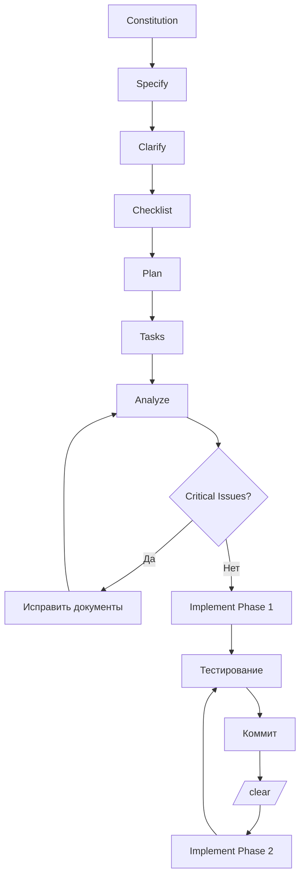

# Рекомендуемый рабочий процесс с GitHub SpecKit

## Полный цикл разработки



## Пошаговая инструкция

### Шаг 1: Constitution (15-30 минут)

**Цель:** Создать "ДНК проекта" — набор незыблемых правил

```bash
/speckit.constitution
```

**Минимальный набор для нового проекта:**
1. Стек технологий (Python FastAPI + Vue.js + TypeScript)
2. Ключевая интеграция (Telegram Bot API для публикации)
3. Основной функционал (Markdown конвертер с проверкой синтаксиса)
4. Требования безопасности (Токены хранить в переменных окружения)
5. Git workflow (Один коммит = одна таска)

**Для существующего проекта:**
```bash
/speckit.constitution
Проанализируй текущий код и создай constitution на его основе.
```

**Лайфхак:** Используйте ChatGPT для генерации первого драфта constitution на основе ваших требований.

---

### Шаг 2: Specify (30-60 минут)

**Цель:** Детально описать ЧТО и ЗАЧЕМ, без технических деталей

```bash
/speckit.specify
```

**Подготовка через ChatGPT:**
```
Мне нужно сделать приложение для публикации в Telegram через Bot API.
Пользователь пишет текст в markdown редакторе, видит превью,
система автоматически исправляет ошибки форматирования.

Создай детальную спецификацию включая:
- Все основные функции
- Edge cases
- Success criteria
- User stories

Используй конкретные примеры.
```

**Структура хорошей спецификации:**

✅ **User Story Mapping:**
```
Путь пользователя при создании поста:
1. Подключить Telegram бот →
2. Написать текст в редакторе →
3. Увидеть превью как в Telegram →
4. Исправить ошибки форматирования →
5. Нажать "Опубликовать" →
6. Увидеть пост в канале
```

✅ **Конкретные критерии успеха:**
```
- Превью обновляется < 100ms после ввода символа
- Публикация поста < 2 секунд
- Автосохранение каждые 30 секунд
- Retry при ошибке API: 3 попытки с интервалом 5 секунд
```

✅ **Разделение MVP и будущих фич:**
```
MVP (минимальный запуск):
- Markdown редактор с превью
- Публикация в один канал Telegram
- Автосохранение черновиков

Версия 2.0:
- Публикация в несколько ресурсов
- Шаблоны постов

Версия 3.0:
- Отложенная публикация по расписанию
- Аналитика просмотров
```

**После создания:**
1. Прочитайте сами — всё понятно? Нет противоречий?
2. Переходите к `/speckit.clarify`

---

### Шаг 3: Clarify (20-40 минут)

**Цель:** Найти слепые зоны в спецификации

```bash
/speckit.clarify
```

**Что делает AI:**
Анализирует спецификацию и задаёт вопросы по категориям:
- Authentication & Authorization
- Data Validation & Limits
- Error Handling
- Edge Cases
- Performance & Scale
- Security & Privacy
- API Integration

**Как отвечать:**

❌ **Плохо:**
```
Q: Как обрабатывать длинные посты?
→ B) Показать ошибку
```

✅ **Хорошо:**
```
Q: Как обрабатывать длинные посты?
→ Показывать предупреждение в редакторе при превышении лимита.
   Предложить варианты:
   1. Сократить текст вручную
   2. Разбить на несколько постов автоматически
   3. Сохранить как черновик для редактирования
```

**После ответов AI:**
- Обновляет spec.md новыми требованиями
- Дополняет Key Entities
- Расширяет Success Criteria
- Создаёт заметки для plan.md

**Лайфхак:** Если не знаете как ответить, закиньте вопросы в отдельный чат с нейросетью для исследования.

---

### Шаг 4: Checklist (15-30 минут)

**Цель:** Структурированная проверка качества

```bash
/speckit.checklist UX
/speckit.checklist Security
```

**Обязательные темы для всех проектов:**
- **UX** — для всех проектов
- **Security** — для всех проектов с пользовательским вводом

**Дополнительно по необходимости:**
```bash
/speckit.checklist Performance
/speckit.checklist Accessibility
/speckit.checklist Testing
/speckit.checklist Mobile-First Design  # кастомная тема
```

**Как использовать:**
1. Создайте чек-лист
2. Честно ответьте на каждый пункт
3. Для каждого ❌ дополните спецификацию
4. Перезапустите checklist и убедитесь что теперь все ✅

**Аналогия:**
- Clarify — это интервью с умным коллегой
- Checklist — это аудит по стандартам качества

---

### Шаг 5: Plan (30-60 минут)

**Цель:** Превратить "что нужно" в конкретный технический план

```bash
/speckit.plan

Backend: Python FastAPI + TypeScript
Frontend: Vue.js 3
UI: Tailwind CSS + shadcn-vue
База данных: PostgreSQL
Деплой: Docker
```

**Что создаётся:**
- `plan.md` — детальный план разработки
- `research.md` — исследование технологий
- `database-schema.md` — схема базы данных
- `api-documentation.yaml` — OpenAPI спецификация
- `quickstart.md` — инструкции для быстрого старта

**Критически важно:**
- Читайте план критически, не принимайте на веру
- Запрашивайте альтернативы для ключевых решений:
  ```
  Ты предложил PostgreSQL для БД. Какие альтернативы есть?
  Сравни PostgreSQL vs SQLite vs MongoDB для этого проекта.
  ```
- Упрощайте для MVP

**Лайфхак:** Используйте ChatGPT для review плана:
```
Вот технический план проекта: [вставляете plan.md]

Проанализируй:
1. Есть ли переусложнения?
2. Где могут быть bottleneck'и?
3. Какие риски ты видишь?
4. Что можно упростить для MVP?
```

---

### Шаг 6: Tasks (10-20 минут)

**Цель:** Разбить план на последовательные задачи

```bash
/speckit.tasks
```

**Что делает AI:**
- Анализирует технический план
- Выявляет dependencies между задачами
- Определяет критический путь (⭐ must-have для MVP)
- Группирует задачи по фазам (обычно 5-7 фаз)
- Оценивает сложность (простая/средняя/сложная)

**Структура каждой задачи:**
- ID (T001, T002...)
- Маркер Critical ⭐
- Сложность и время
- Описание
- Acceptance Criteria
- Files to create
- Dependencies

**Важно:**
- Больше половины задач — это "nice to have", не MVP
- Реализация MVP позволяет тестировать работу приложения, пока агент продолжает писать
- Детальное описание каждой задачи экономит тонны времени

---

### Шаг 7: Analyize (15-30 минут) × 2 минимум

**Цель:** Найти проблемы, конфликты и несоответствия

```bash
/speckit.analyze
```

**Что анализируется:**
- spec.md, plan.md, tasks.md
- database-schema.md, api-documentation.yaml
- constitution.md

**Типы найденных проблем:**
- Конфликты между требованиями
- Несоответствия между spec и plan
- Технические невозможности
- Упущенные edge cases
- Нереалистичные оценки
- Противоречия в dependencies

**Workflow:**
1. Первый запуск → находим проблемы
2. Исправляем Critical проблемы в соответствующих файлах
3. Повторный запуск → проверяем что исправлено
4. Повторяем до "No critical issues found"

**Лайфхак:** Если не понимаете проблему, попросите AI объяснить:
```
Issue H001 — не понял.
Объясни на примере: что конкретно может пойти не так?
Приведи сценарий шаг за шагом.
```

**И попросите предложить решение:**
```
Как лучше всего исправить C003?
Предложи 3 варианта с плюсами и минусами каждого.
```

---

### Шаг 8: Implement (пофазно)

**Цель:** Последовательная реализация задач

**ВАЖНО:** Это не генерация кода в одно нажатие. Это управляемый процесс разработки с вашим контролем.

#### Рекомендуемый workflow (одна фаза = одна сессия)

```
Сессия 1:
1. /speckit.implement Phase 1
2. Ждёте завершения
3. Тестируете результат
4. git commit -m "Phase 1 complete"
5. /clear

Сессия 2:
1. /speckit.implement Phase 2
2. Ждёте завершения
3. Тестируете результат
4. git commit
5. /clear

... и так далее
```

**Варианты команды:**
```bash
/speckit.implement Phase 1           # только первая фаза
/speckit.implement Phase 1-2         # первые две фазы
/speckit.implement T001, T002, T003  # конкретные задачи
```

**Формат коммита:**
```bash
git commit -m "T005: Create Markdown Editor Component

- Add editor with syntax highlighting
- Configure live preview
- Implement auto-save

Closes T005"
```

**Если задача слишком сложная:**
```
Задача T014 слишком сложная. Разбей её на 5-7 под-задач,
каждая должна быть выполнима за 30-60 минут.
```

**Если код непонятен:**
```
Объясни что делает эта функция в MarkdownConverter.py строки 45-78.
Почему использован regex здесь? Какую проблему он решает?
```

---

## Ключевые правила рабочего процесса

1. **Не пропускать Clarify** — находит то, о чём вы не подумали
2. **Checklist минимум 2 темы** — UX и Security обязательны
3. **Plan критически проверять** — не принимать на веру, упрощать для MVP
4. **Tasks: фокус на Critical** — 70% задач это nice-to-have, а не MVP
5. **Analyze минимум 2 раза** — лучше потратить час на исправление спеков, чем день на переписывание кода
6. **Implement по фазам** — одна фаза = одна сессия = один коммит
7. **Тестировать после каждой фазы** — баг в Phase 1 может сломать Phase 2, 3, 4
8. **Делать /clear между этапами** — для уменьшения галлюцинаций и экономии токенов

---

## Связанные темы

- [GitHub SpecKit: основная статья](./index.md)
- [Команды SpecKit: полный справочник](./commands.md)
- [Лучшие практики и типичные ошибки](./best-practices.md)
