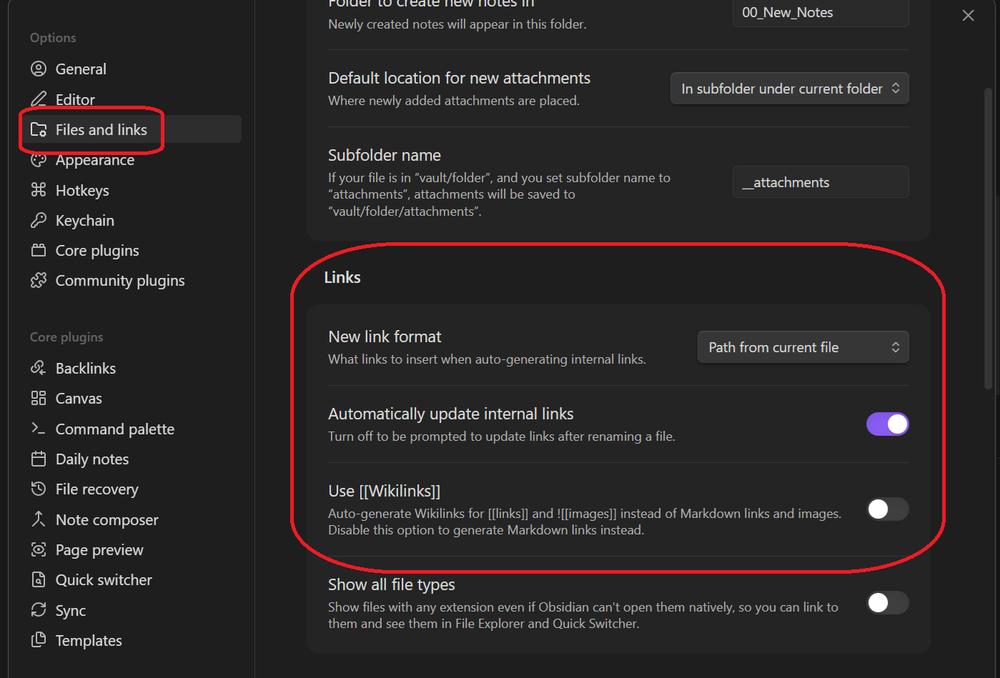
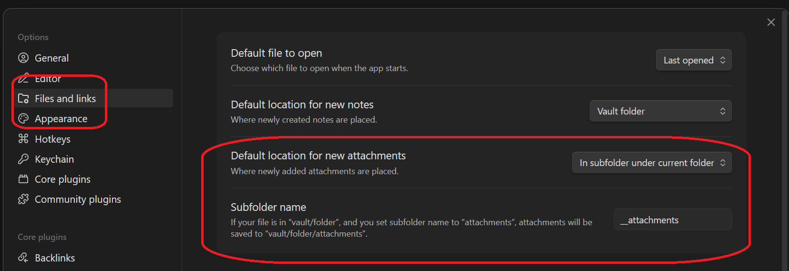
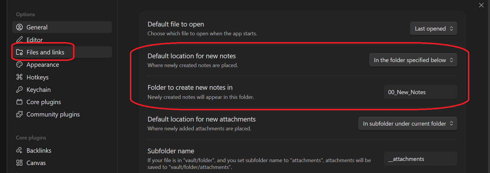
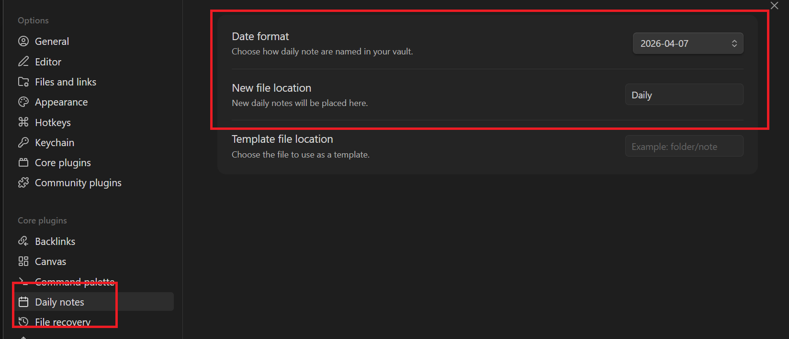
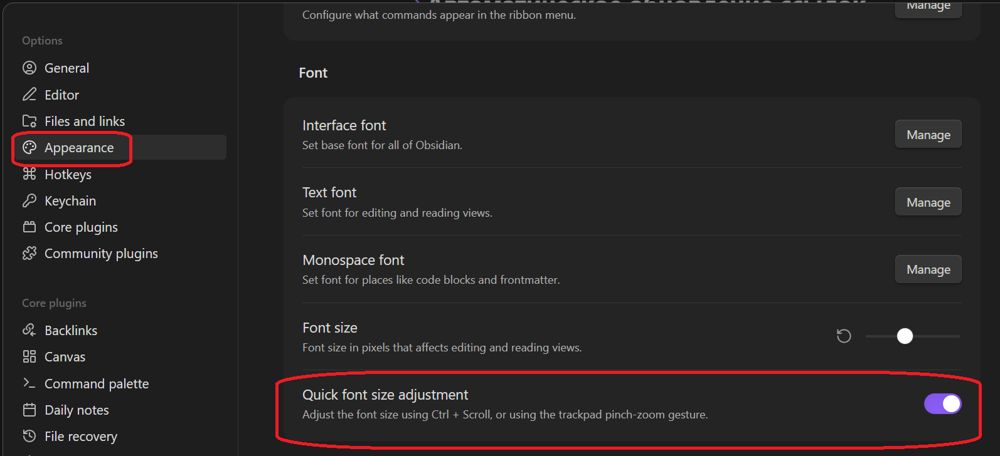
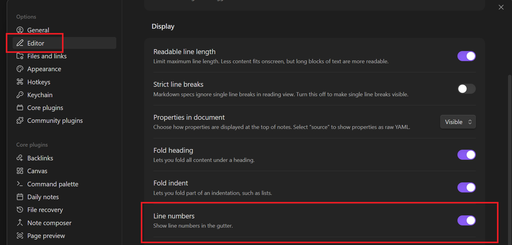

---
tags:
  - obsidian
  - settings
---
## Автоматическое обновление ссылок

## Автоматическое сохранение файлов в поддиректории *attachments*

## Расположение новых заметок

## Формат и расположение дейликов

## Масштабирование

## Отображать номера строк

