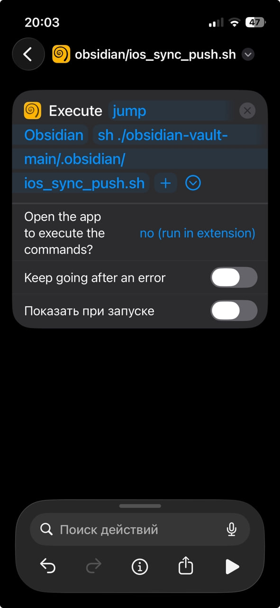
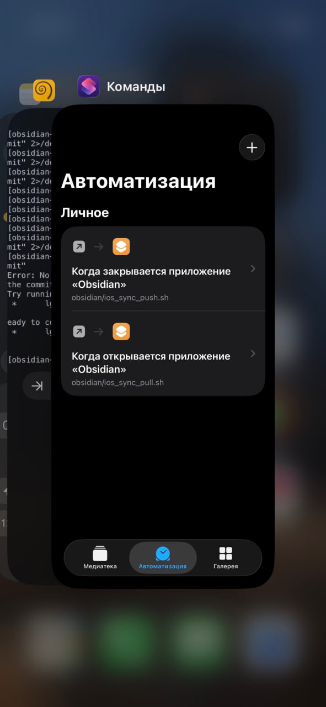

# PC ez Sync

Auto pull on open and push on close

## Obsidian vault demo
- [https://github.com/my-repositories/obsidian-vault-demo](https://github.com/my-repositories/obsidian-vault-demo)

## Windows
- Установить расширение [PC ez Sync](https://github.com/my-repositories/obsidian-pc-ez-sync/releases/latest)
- Положить расширение в `<VAULT>/.obsidian/plugins/pc-ez-sync`

## Android
- [Issue #1](https://github.com/my-repositories/obsidian-pc-ez-sync/issues/1)
  
## macOS
- [Issue #2](https://github.com/my-repositories/obsidian-pc-ez-sync/issues/2)

## Linux
- [Issue #3](https://github.com/my-repositories/obsidian-pc-ez-sync/issues/3)

## iOS
- Установить приложение [Shortcuts](https://apps.apple.com/us/app/shortcuts/id915249334)
- Установить приложение [TestFlight](https://apps.apple.com/ru/app/testflight/id899247664)
- Установить приложение [a-Shell](https://testflight.apple.com/join/WUdKe3f4) 
- Создать `PAT_TOKEN` на [GitHub](https://github.com/settings/tokens)
- Открыть `a-Shell`
- Выбрать хранилище, используя команду `pickupFolder`
- Сделать закладку на это хранилище `bookmark Obsidian`
- Склонировать репозиторий
```sh
export PAT_TOKEN="ghp_ABCDEF"
export REPO_OWNER="loktionov129"
export REPO_NAME="storage"
lg2 clone "https://${PAT_TOKEN}@github.com/${REPO_OWNER}/${REPO_NAME}.git"
mv "${REPO_NAME}.git" $REPO_NAME
cd $REPO_NAME
lg2 config user.name "Aleksandr Loktionov"
lg2 config user.email "loktionov129@gmail.com"

```

- Создать скрипт `./${REPO_NAME}/.obsidian/ios_sync_pull.sh"`
```sh
#!/bin/sh
(cd ./obsidian-vault-main && lg2 pull)
```

- Создать скрипт `./${REPO_NAME}/.obsidian/ios_sync_push.sh"`
```sh
#!/bin/sh
(cd ./obsidian-vault-main  && lg2 add . && lg2 commit -m 'iOS sync' 2>/dev/null && lg2 push)
```

- Сделать скрипты исполняемыми
```sh
chmod +x ./obsidian-vault-main/.obsidian/ios_sync_pull.sh
chmod +x ./obsidian-vault-main/.obsidian/ios_sync_push.sh
```

- Создать команды `obsidian/pull` и `obsidian/push` в приложении `Shortcuts`
```sh
  jump Obsidian
```

```sh
  sh "./obsidian-vault-main/.obsidian/ios_sync_{push|pull}.sh"
```
 
- Настроить Выполнение этих команд при открытии/закрытии Obsidian в приложении `Shortcuts`
 

## Notes:
- Также опционально можно добавить .gitignore
```md
# Obsidian UI state (essential to ignore to avoid merge conflicts)
.obsidian/workspace.json
.obsidian/workspace-mobile.json

# (Optional) Ignore plugins if you prefer to reinstall them manually
.obsidian/plugins/*
.obsidian/community-plugins.json
.obsidian/core-plugins.json

# Obsidian internal trash
.trash/

# OS-specific files
.DS_Store
```